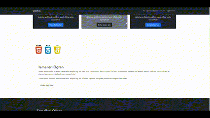

<h1> Bootstrap Proje</h1>

Bootstrap Kütüphanesini kullanarak yaptığım proje.
Proje bootstrapin çalışma mantığını anlamamıza yardımcı oldu ve kendimi geliştirmemde yardımcı oldu.

<h2> Kullanılan Teknolojiler </h2>
-Html
-Bootstrap
-Css
-JavaScript

<h2> Ekran Görüntüsü </h2>

